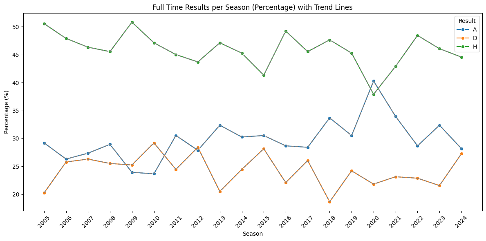
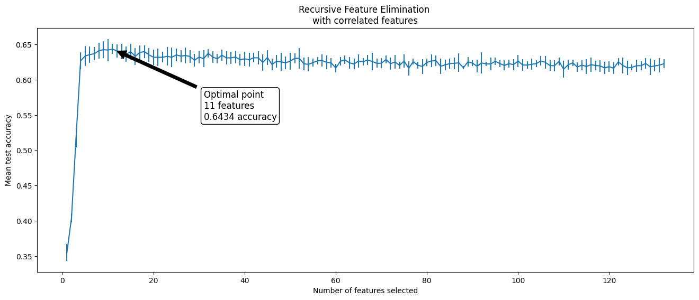
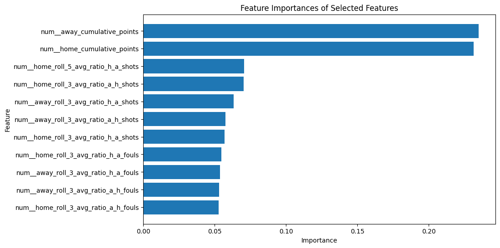
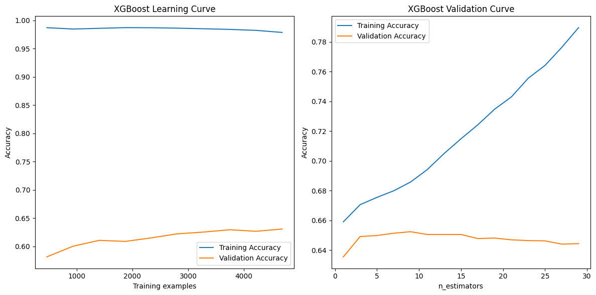
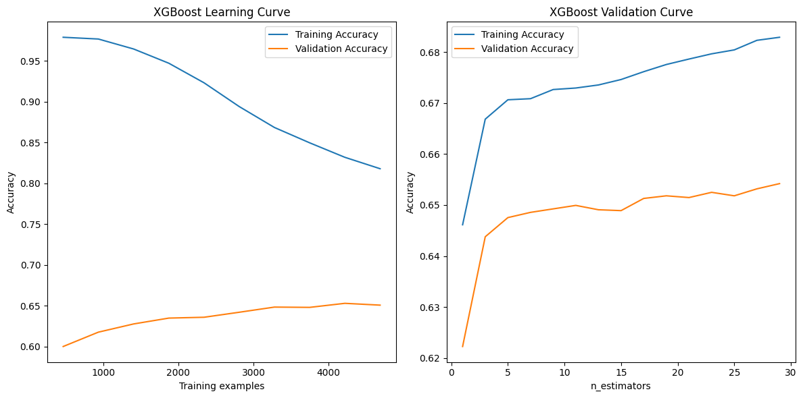
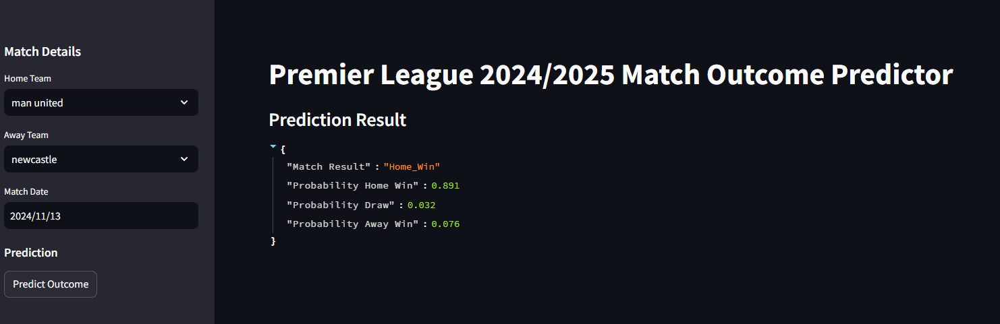

# Midterm Project: Premier League Football Prediction

## Overview

This project aims to predict the outcomes of Premier League football matches using machine learning models. It explores various features to determine their importance in predicting match results—whether it’s a home win, draw, or away win.

## Table of Contents

- [Midterm Project: Premier League Football Prediction](#midterm-project-premier-league-football-prediction)
  - [Overview](#overview)
  - [Table of Contents](#table-of-contents)
  - [Problem Description](#problem-description)
  - [Data](#data)
  - [Scripts](#scripts)
    - [01\_data\_gathering](#01_data_gathering)
    - [02\_data\_preparation](#02_data_preparation)
    - [03\_eda](#03_eda)
    - [04\_train\_model](#04_train_model)
    - [05\_back\_testing](#05_back_testing)
  - [Getting Started](#getting-started)
    - [Prerequisites](#prerequisites)
    - [Clone the Repository](#clone-the-repository)
    - [Installing Dependencies](#installing-dependencies)
      - [Navigate to Your Project Directory](#navigate-to-your-project-directory)
      - [Install the Project Dependencies](#install-the-project-dependencies)
      - [Activate the Virtual Environment](#activate-the-virtual-environment)
    - [Running Docker](#running-docker)
    - [Running on AWS Elastic Beanstalk](#running-on-aws-elastic-beanstalk)
      - [Running Locally](#running-locally)
      - [Running Remotely](#running-remotely)
    - [Testing the Model](#testing-the-model)
    - [Running the Streamlit App (Bonus)](#running-the-streamlit-app-bonus)
  - [Contributing](#contributing)

## Problem Description

Predicting the outcomes of football matches has always been a challenging yet fascinating task for sports analysts and enthusiasts. This project focuses on the Premier League, aiming to build robust machine learning models to forecast match results—whether it’s a home win, draw, or away win. By leveraging historical match data and team statistics, the project seeks to identify key features that influence match outcomes. Despite the inherent unpredictability and dynamic nature of sports betting markets, this project aspires to provide valuable insights and potentially profitable predictions.

## Data

The raw data for this project is sourced from [Football Data](https://www.football-data.co.uk/data.php). The focus is exclusively on the Premier League, covering seasons from 2005/2006 to 2024/2025. The raw data files can be found [here](https://github.com/RuiFSP/mlzoomcamp2024-midterm-project/tree/main/data/raw_data).

For the last twenty years, the tendency has been for the home teams to win the majority of games, which is really common for this type of sport because there is always an associated home factor.



## Scripts

### 01_data_gathering

During data gathering, the following key steps are performed:

The `data_gathering` function in the `01_data_gathering.py` script encapsulates these steps. It ensures the necessary directories exist, downloads the CSV files for the specified seasons, checks the columns in the files, concatenates the data, and saves the processed data.

For more details, see the [01_data_gathering.py](scripts/01_data_gathering.py) script.

### 02_data_preparation

The `02_data_preparation.py` script performs the following key steps:

1. **Data Cleaning**: Fix column names, handle missing values, and ensure data integrity.
2. **Feature Engineering**: Create new features such as goal difference, total shots, shot accuracy, and time-based features.
3. **Rolling Averages**: Calculate rolling averages for various statistics over 3 and 5 game windows.
4. **Cumulative Points**: Compute cumulative points for home and away teams.
5. **Normalize Betting Odds**: Convert betting odds to implied probabilities.
6. **Save Processed Data**: Save the processed data for the current season (2024/2025) and the final prepared dataset to CSV files.

For more details, see the [02_data_preparation.py](scripts/02_data_preparation.py) script.

### 03_eda

The `03_data_eda.py` script is dedicated to Exploratory Data Analysis (EDA). It includes the following key steps:

1. **Data Checking**: Check data types, missing values, unique values, duplicates, and outliers.
2. **Correlation Analysis**: Identify highly correlated features using a correlation matrix.
3. **Variance Inflation Factor (VIF)**: Calculate VIF to check for multicollinearity and remove features with high VIF values.
4. **Cluster Maps**: Plot clustered heatmaps to visualize feature correlations.
5. **Target Distribution**: Visualize the distribution of the target variable.
6. **Saving Data**: Save the cleaned and processed data for modeling and backtesting.

For more details, see the [03_data_eda.py](scripts/03_data_eda.py) script.

### 04_train_model

The `04_train_model.py` script covers the following key steps:

- **Data Preprocessing**: Prepare the data for modeling.
- **Feature Selection**: Use Recursive Feature Elimination with Cross-Validation (RFECV) to select important features.



Check documentation about RFECV in: [Scikit_learn-RFECV](https://scikit-learn.org/1.5/modules/generated/sklearn.feature_selection.RFECV.html)



- **Model Evaluation**: Evaluate models using RandomForest and XGBoost classifiers.

> For example, here the model was overfitting in training data



- **Hyperparameter Tuning**: Tune hyperparameters to reduce overfitting.

> After hyperparameter tuning we were able to decrease overfitting



- **Model Finalization**: Finalize the best model using a pipeline and save it for future predictions.

For more details, see the [04_train_model.py](scripts/04_train_model.py) script.

### 05_back_testing

The `05_back_testing_market.py` script includes the following key steps:

- **Loading the Model and Data**: Load the trained model and test datasets.
- **Making Predictions**: Generate predictions and prediction probabilities using the model.
- **Preparing Data for Analysis**: Combine predictions with actual results and market probabilities.
- **Calculating Brier Scores**: Compute Brier scores for both the model's predictions and the market probabilities.
- **Comparing Performance**: Compare the average Brier scores of the model and the market.

For more details, see the [05_back_testing_market.py](scripts/05_back_testing_market.py) script.

## Getting Started

### Prerequisites

- Python 3.8 or higher
- Docker
- Pipenv

### Clone the Repository

Use `git clone` to copy the repository to your local machine and navigate into the project directory.

```bash
  git clone <repository-url>
  cd repository
```

Replace `repository-url` with the actual URL of the repository (for example, from GitHub, GitLab, etc.)

```bash
  git clone https://github.com/username/repository.git
  cd repository
```

### Installing Dependencies

#### Navigate to Your Project Directory

First, open a terminal and change to the directory where your `Pipfile` and `Pipfile.lock` are located.

```bash
  cd /path/to/your/project
```

#### Install the Project Dependencies

In the project directory, use `pipenv install` to create the virtual environment and install all dependencies specified in the `Pipfile.lock`.

```bash
  pipenv install
```

This command will:

- Create a virtual environment if one doesn’t already exist.
- Install the dependencies exactly as specified in the `Pipfile.lock`.

#### Activate the Virtual Environment

To activate the virtual environment, use:

```bash
  pipenv shell
```

Now you're in an isolated environment where the dependencies specified in the `Pipfile.lock` are installed.

### Running Docker

Build the Docker image:

```bash
    docker build -t <docker_image_name> .
```

Run the Docker container:

```bash
    docker run -it --rm -p 9696:9696 <docker_image_name>
```

> **Note:**  
> If you get an error with `[ 5/11] RUN 'pipenv install --system --deploy'`, try turning off your VPN.

### Running on AWS Elastic Beanstalk

#### Running Locally

To run Elastic Beanstalk locally, follow these steps:

1. **Install the AWS Elastic Beanstalk CLI**:
   Ensure you have the AWS CLI and Elastic Beanstalk CLI installed. You can install the Elastic Beanstalk CLI using pip:

   ```bash
   pip install awsebcli
   ```

2. **Initialize Elastic Beanstalk**:
   Navigate to your project directory and initialize Elastic Beanstalk:

   ```bash
   eb init
   ```

   Follow the prompts to set up your application. Choose the appropriate region and select the platform (e.g., Python).

3. **Create an Environment and Deploy**:
   Create a new environment and deploy your application:

   ```bash
   eb create <environment-name>
   eb deploy
   ```

   Replace `<environment-name>` with your desired environment name.

4. **Access Your Application**:
   After deployment, you can access your application using the URL provided by Elastic Beanstalk.

5. **Update Your Application**:
   To deploy updates, use the `eb deploy` command again:

   ```bash
   eb deploy
   ```

6. **Terminate the Environment**:
   When you are done, you can terminate the environment to stop incurring charges:

   ```bash
   eb terminate <environment-name>
   ```

> **Note:** Ensure your `Dockerrun.aws.json` or `Dockerfile` is correctly configured for Elastic Beanstalk.

#### Running Remotely

To deploy the project on AWS Elastic Beanstalk remotely and resolve common errors, follow these steps:

1. **Create a Launch Template in the AWS EC2 Console**:
   - Go to the EC2 Console in your AWS account.
   - In the left-hand menu, choose Launch Templates (under Instances).
   - Select Create launch template and fill in the required fields:
     - Launch Template Name: Use something identifiable, like `eb-launch-template`.
     - AMI ID: Select a compatible Amazon Linux 2 AMI.
     - Instance Type: Choose an instance type that suits your application needs (e.g., `t2.micro`).
   - Click Create launch template and note the Launch Template ID (e.g., `lt-0abcdef1234567890`).

2. **Configure Elastic Beanstalk to Use the Launch Template**:
   - In your Elastic Beanstalk project directory, create or open the `.ebextensions` folder.
   - In `.ebextensions`, create a configuration file named `00_launch_template.config` with the following YAML code:

   ```yaml
   Resources:
     AWSEBAutoScalingGroup:
       Type: AWS::AutoScaling::AutoScalingGroup
       Properties:
         MixedInstancesPolicy:
           InstancesDistribution:
             OnDemandPercentageAboveBaseCapacity: 100
           LaunchTemplate:
             LaunchTemplateSpecification:
               LaunchTemplateId: "lt-XXXXXXXXX"  # Replace with your Launch Template ID
               Version: "1"  # Use the appropriate version of your template
   ```

   - Replace `lt-0abcdef1234567890` with your actual Launch Template ID from Step 1.
   - Save the file, ensuring it is in the project root folder.

3. **Deploy or Re-create Your Elastic Beanstalk Environment**:
   - If the environment already exists, you can update it with this new configuration:

   ```bash
   eb deploy
   ```

   - Alternatively, if you need to re-create the environment, terminate the current one (if any) and create a new one:

   ```bash
   eb terminate <environment-name>  # Only if you need to delete the existing environment
   eb create <new-environment-name>
   ```

   This configuration should allow Elastic Beanstalk to deploy without attempting to use the deprecated Launch Configuration, solving the Auto Scaling Launch Configuration failed errors.

### Testing the Model

Open a new terminal and run the test script:

```bash
    python tests/test_predict.py    
```

To use the prediction service, send a POST request to the /predict endpoint with the following JSON payload:

```bash
curl -X POST http://127.0.0.1:9696/predict \
     -H "Content-Type: application/json" \
     -d '{
           "home_team": "arsenal",
           "away_team": "liverpool",
           "date": "2024-12-16"
         }'
```

### Running the Streamlit App (Bonus)

To run the Streamlit app locally, follow these steps:

1. Ensure you have all dependencies installed and the virtual environment activated as described in the [Installing Dependencies](#installing-dependencies) section.

2. Navigate to the project directory where `app.py` is located.

3. Run the Streamlit app using the following command:

```bash
    streamlit run app.py
```



## Contributing

Contributions are welcome! Please open an issue or submit a pull request for any improvements or bug fixes
